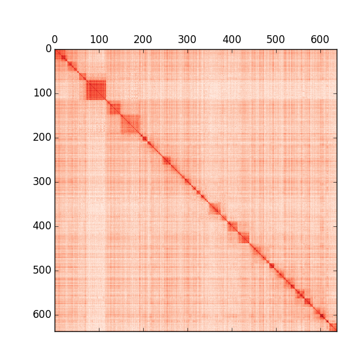

*Update*: this low-memory bug has been [fixed](https://github.com/chrchang/plink-ng/commit/a3b34a675f0482b89d7acb9fc4ea8fedf87f3d45).


Setup
-----

Download and build tool binaries. Assumes 64-bit linux platform.

```bash
$ make install-tools
```

Install Python packages (numpy, pandas, matplotlib). One way:

```bash
$ pip install -r requirements.txt
```

Analysis pipeline
-----------------

```bash
$ make init fetch-vcf
```

```bash
$ make FMT=bin project
```


```bash
$ make FMT=bin4 project
```


Result using plink-1.07 `--matrix` with 5kb bins:


