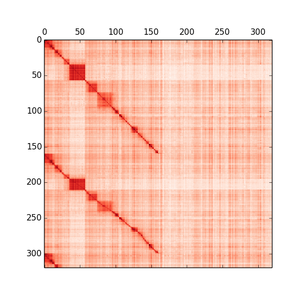
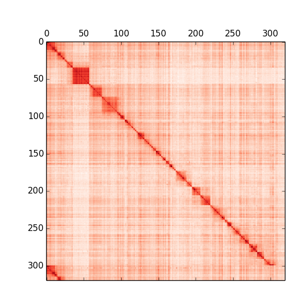

Setup
-----

Download and build tool binaries. Assumes 64-bit linux platform.

```bash
$ make install-tools
```

Install Python packages (numpy, pandas, matplotlib). One way:

```bash
$ pip install -r requirements.txt
```

Analysis pipeline
-----------------

```bash
$ make init fetch-vcf
```

```bash
$ make FMT=bin project
```



```bash
$ make FMT=bin4 project
```




